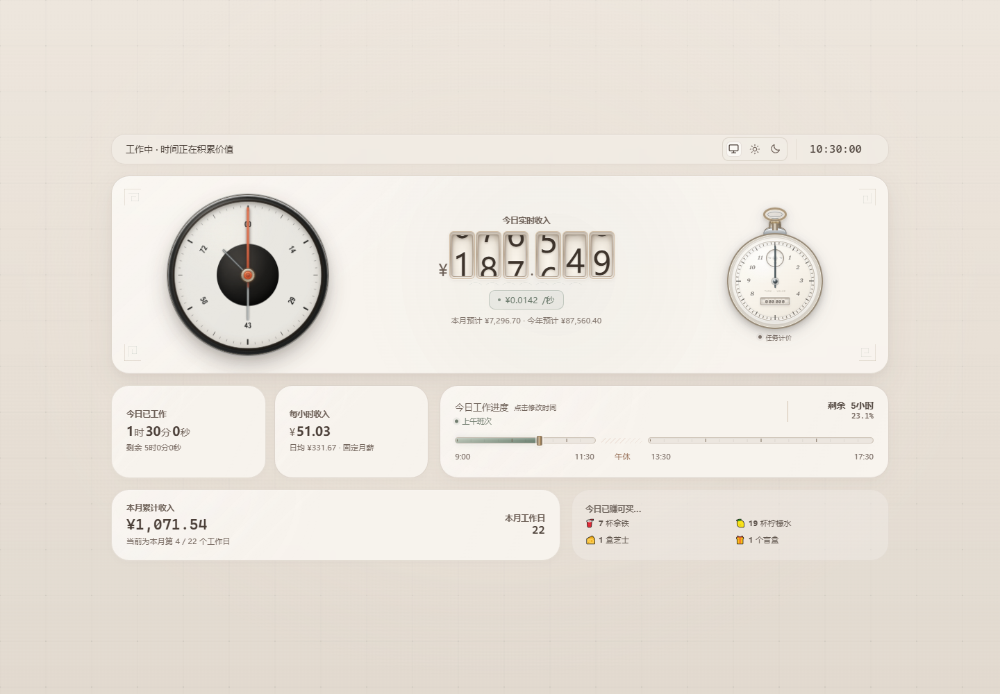
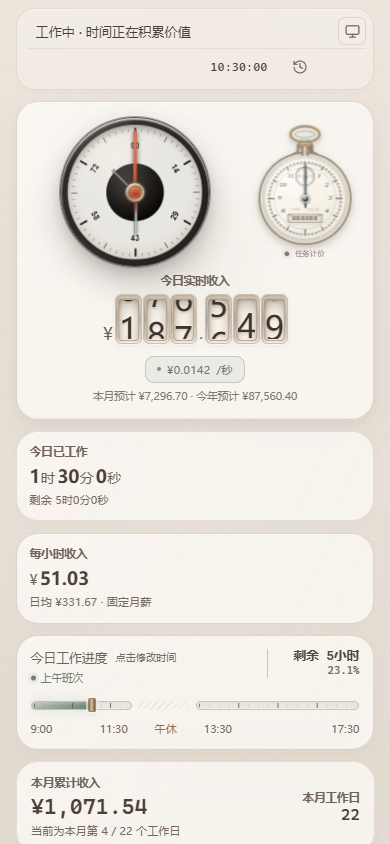

# Income-per-sed

[](https://github.com/ZeusCupidCloris/Income-per-sed/actions/workflows/quality.yml)
[](https://github.com/ZeusCupidCloris/Income-per-sed/actions/workflows/pages.yml)
[](#版权与使用限制)

一个离线运行的收入仪表与任务计价工具。页面采用机械表盘、数字滚轮和怀表码表视觉语言，按工作时间实时展示今日收入、本月累计、工作进度，并支持历史回溯。

[在线体验](https://zeuscupidcloris.github.io/Income-per-sed/) · [下载最新版本](https://github.com/ZeusCupidCloris/Income-per-sed/releases/latest) · [查看完整说明书](docs/Income-per-sed（说明文档）.docx)



## 下载与版本

| 文件 | 用途 |
| --- | --- |
| `Income-per-sed-Push.html` | 日常使用与分发版本，单文件离线运行 |
| `Income-per-sed-Develop.html` | 开发维护版本，保留结构化注释、诊断接口与回归检查 |
| `IncomeWidget.js` | Scriptable iPhone 桌面小组件 |
| `docs/Income-per-sed（说明文档）.docx` | 使用、计算、维护与验证手册 |
| `SHA256SUMS.txt` | 正式交付文件的完整性校验值 |

推荐从 [GitHub Releases](https://github.com/ZeusCupidCloris/Income-per-sed/releases) 下载已标记版本。日常运行使用 Push 版；排查动画、布局、存储、日历或计算问题时使用 Develop 版。

## 仓库结构

根目录只保留正式交付文件、版本清单、校验值和标准项目元数据：

- `.github/`：自动检查、Pages、Release、依赖更新和安全策略；
- `config/`：Playwright 浏览器测试配置；
- `docs/`：Word 说明书、预览图、发布说明和维护策略；
- `scripts/`：Push 构建、发布校验、预览生成和 Pages 在线核验；
- `tests/`：功能、韧性、视觉回归及 WebKit 测试；
- 根目录的三个应用文件：正式 Push、Develop 源文件和 iPhone 小组件。

## 源文件与发布关系

- `Income-per-sed-Develop.html` 是唯一维护源文件。
- `Income-per-sed-Push.html` 是由 Develop 自动去除开发诊断代码并压缩后得到的发布文件，不应直接编辑。
- `release-manifest.json` 统一记录产品版本、内部版本、构建编号、发布日期和交付文件。
- `npm run release:prepare` 一次完成换行规范化、Push 构建、Word 哈希同步、校验清单生成和最终验证。
- Pull Request 必须通过发布校验、Windows Edge 视觉回归和 WebKit 基础检查。
- 正式版本必须从 `main` 上的 `v*` 标签发布，Release 工作流会重新生成 Push、校验版本和 SHA-256 后再上传。

维护规则与发版步骤见 [仓库维护与发布策略](docs/REPOSITORY_POLICY.md)。

## 主要能力

- 固定月薪、年度平均、固定日薪三种收入计算方式
- 按上午、午休、下午工作时段实时计算
- 今日收入、时薪、秒薪、本月累计和年度估算
- 历史日期回溯、暂停、播放与返回实时
- 独立任务计价码表
- 浅色、深色及跟随系统主题
- 桌面、手机、平板和超宽屏响应式布局
- 浏览器本地存储、多窗口同步与 Scriptable 设置同步
- 法定节假日和调休工作日识别
- 高对比度、强制色彩和减少动态效果支持

## 快速开始

1. 下载并打开 `Income-per-sed-Push.html`。
2. 点击“每小时收入”卡片设置收入计算方式。
3. 点击“今日工作进度”卡片设置工作时间。
4. 页面会根据当前时间自动计算收入和进度。
5. iPhone 用户可将 `IncomeWidget.js` 与 Push 页面放入 iCloud Drive 的 Scriptable 目录。

## 在线预览

GitHub Pages 会将 Push 版作为静态页面发布。在线版与下载版使用相同 HTML；下载后仍可完全离线运行。

手机版首屏预览：



## 隐私与数据

- 页面没有后台服务、账户系统或数据上报功能。
- 工资、工作时间、主题和历史设置保存在当前浏览器的本地存储中。
- Scriptable 小组件数据保存在设备本地或用户自己的 iCloud Drive 中。
- 清除浏览器站点数据会删除页面设置，重要配置请按说明书中的方式备份。

## 兼容性

- 桌面端建议使用最新稳定版 Chrome 或 Microsoft Edge。
- iPhone、iPad 建议使用最新稳定版 Safari；小组件需要 Scriptable。
- 支持键盘操作、触屏、鼠标滚轮和触控板。
- 支持 `prefers-reduced-motion`、高对比度和系统主题。

## 质量检查

每次提交会自动执行：

- Develop 到 Push 的可重复构建检查
- Push、Develop 与 Widget 必需结构检查
- JavaScript 语法检查
- Word 说明书 OOXML/ZIP 完整性检查
- SHA-256 校验文件一致性检查
- 390、768、1440、2560 像素宽度布局检查
- 浅色、深色、手机版快速回溯面板截图回归
- Safari/WebKit 的手机版启动和快速回溯面板检查

本地验证：

```powershell
npm ci
npm run test:release
npm run release:prepare
npm test
npm run test:webkit
```

## 当前版本

- 应用版本：`2.5.1`
- 页面基线：Pocket Watch v35 / R35
- 构建日期：2026-08-06
- 更新记录：[CHANGELOG.md](CHANGELOG.md)

## 版权与使用限制

Copyright © 2026 ZeusCupidCloris. All rights reserved.

本仓库公开仅用于作品展示、在线预览和版本存档，**不是开源软件**。除非仓库所有者事先书面授权，否则不授予任何人复制、修改、分发、再发布、转售、再许可或制作衍生作品的权利。公开可见不代表获得使用授权。完整条款见 [LICENSE](LICENSE)，安全问题请按 [安全策略](.github/SECURITY.md) 私密报告。

允许访问者通过本仓库提供的 GitHub Pages 在线查看页面，并为个人评估目的下载未经修改的正式 Release 文件；任何其他用途均需事先取得仓库所有者的书面许可。
