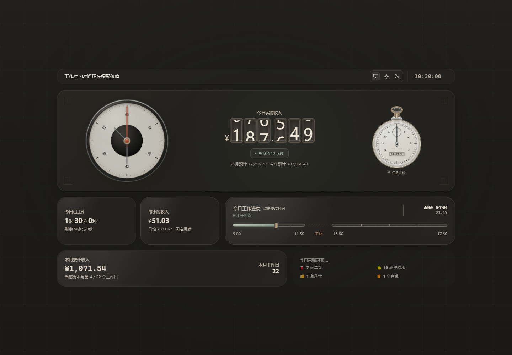

# Income-per-sed

[](https://github.com/ZeusCupidCloris/Income-per-sed/actions/workflows/quality.yml)
[](https://github.com/ZeusCupidCloris/Income-per-sed/actions/workflows/pages.yml)
[](#版权与使用限制)

一个可离线运行的收入仪表与任务计价工具。页面以机械表盘、数字滚轮和怀表码表呈现今日收入、工作进度与月度统计，并提供历史回溯、主题切换和 Scriptable iPhone 小组件。

[在线体验](https://zeuscupidcloris.github.io/Income-per-sed/) · [下载正式版本](https://github.com/ZeusCupidCloris/Income-per-sed/releases/latest) · [打开完整说明书](docs/Income-per-sed（说明文档）.docx) · [查看更新记录](CHANGELOG.md)


<details>
<summary>查看深色模式预览</summary>



</details>

## 项目状态

| 项目 | 当前状态 |
| --- | --- |
| 仓库候选版本 | `2.5.4-rc.2`，不等同于已发布正式 Release |
| 页面基线 | Pocket Watch `v35` / R44 |
| 小组件版本 | `2.5.1`，保持原始布局与圆润字形 |
| 最新仓库基准 | 2026-09-06，动态轨道刻度与卡片留白校准 |
| 唯一维护源 | `Income-per-sed-Develop.html` |
| 在线版本 | GitHub Pages 自动发布已验证的 Push 文件 |

### 本次更新

- R44 保留机械表盘与数字滚轮，校准卡片圆角、留白与工作轨道刻度。轨道按实际上午、下午工时分配宽度，提供每 15 分钟小刻度与每小时主刻度。
- 沿用快速回溯、历史播放、返回实时和左上至右下主题过渡。
- 小组件保持 `2.5.1`，统一整数分组、小数精度、四舍五入与“万／亿”缩写，不改布局。
- Word 手册更新 10 张网页图和 2 张小组件模拟图，优化字体、图注与分页。小组件模拟不代表真实 iPhone 验收。

以下预览来自本次 Push 的实际浏览器渲染，使用固定测试日期与示例收入。完整后台、跨浏览器和真实手机验收范围以说明书为准，不将旧版测试结果当作本次验证结果。

维护更新：Develop 已修正旧 R31 样式标识断言，全量诊断重新纳入自动检查。页面样式、动画和小组件未调整。

## 核心体验

- **实时收入仪表**：支持固定月薪、年度平均和固定日薪三种计算方式，连续展示今日收入、时薪、秒薪及年度估算。
- **工作时间轴**：按上午、午休和下午时段计算进度，识别法定节假日、调休工作日及用户日历覆盖。
- **历史回溯**：支持滚轮、触控板、触屏、键盘和快速按钮；可暂停、播放，并平滑返回实时状态。
- **独立任务码表**：以怀表式计时器记录任务时长和计价，不干扰主收入计算。
- **响应式界面**：适配手机、平板、桌面和超宽屏，金额窗会根据位数与可用空间调整。
- **主题与动效**：支持浅色、深色、跟随系统及减少动态效果；弹性方格背景只响应指针附近区域，未交互位置保持平直。
- **本地优先**：没有账户、后台服务或数据上报，工资、时间与主题设置保存在当前设备。
- **iPhone 小组件**：支持 Scriptable 小、中、大号及配件组件；中号采用左表盘、右金额，突出工作状态和关键读数。

## 选择文件

| 文件 | 适用场景 |
| --- | --- |
| `Income-per-sed-Push.html` | 日常使用与分发；单文件、可离线运行 |
| `Income-per-sed-Develop.html` | 开发维护；保留结构化注释、诊断接口与回归导出能力 |
| `IncomeWidget.js` | Scriptable iPhone 桌面小组件 |
| `docs/Income-per-sed（说明文档）.docx` | 功能、计算规则、设置、维护与验证说明书 |
| `SHA256SUMS.txt` | 正式交付文件的 SHA-256 完整性校验值 |
| `release-manifest.json` | 产品版本、内部版本、发布日期及交付文件清单 |

推荐从 [GitHub Releases](https://github.com/ZeusCupidCloris/Income-per-sed/releases) 获取正式交付文件。需要本次候选版时，从当前仓库下载上表四个文件；Release 可能仍是较早版本。日常运行使用 Push 版，维护排查使用 Develop 版。

## 快速开始

1. 下载并打开 `Income-per-sed-Push.html`。
2. 点击“每小时收入”卡片，设置收入计算方式和金额。
3. 点击“今日工作进度”卡片，设置上午、午休和下午时间。
4. 页面会按北京时间、工作日历和当前设置自动计算收入与进度。
5. 需要回看时，可拖动或滚动顶部时间读数，也可打开快速回溯面板。

iPhone 用户可将 `IncomeWidget.js` 与 Push 页面放入 iCloud Drive 的 Scriptable 目录。具体步骤、参数同步方式和故障排查见 [Word 说明书](docs/Income-per-sed（说明文档）.docx)。

## 在线与离线

GitHub Pages 发布的内容与仓库中的 `Income-per-sed-Push.html` 保持字节一致。下载后页面可完全离线运行，收入计算、历史回溯、主题、日历导入和本地设置均不依赖网络。

手机版首屏预览：


## 数据与兼容性

- 工资、工作时间、主题和历史设置保存在浏览器本地存储中。
- Scriptable 小组件数据保存在设备本地或用户自己的 iCloud Drive 中。
- 清除浏览器站点数据会删除页面设置；清理前请记录工资与工作时间。日历按每年手动替换内置数据维护，不依赖自动更新或日常备份。
- 桌面端建议使用最新稳定版 Chrome 或 Microsoft Edge。
- iPhone、iPad 建议使用最新稳定版 Safari；小组件需要 Scriptable。
- 支持键盘、触屏、鼠标滚轮和触控板，并适配高对比度、强制色彩和 `prefers-reduced-motion`。

## 开发与发布

`Income-per-sed-Develop.html` 是唯一维护源。`Income-per-sed-Push.html` 必须由构建流程生成，不应直接编辑。

```powershell
npm ci
npm run quality:local
```

`npm run quality:local` 会依次运行发布流程测试、统一发布准备、README 预览资源校验、Windows Edge 视觉回归和 WebKit 移动端检查。任一阶段失败后命令会立即停止并显示对应阶段，适合在提交 Pull Request 前执行。

`npm run release:prepare` 会按固定顺序完成：

1. 规范化正式文本文件的换行；
2. 从 Develop 重新生成 Push；
3. 同步 Word 说明书中的 Develop、Push 及小组件 SHA-256（兼容旧手册只有两个 HTML 校验值）；
4. 重建 `SHA256SUMS.txt`；
5. 执行完整发布校验，并确认再次运行不会产生额外改动。

Pull Request 必须通过以下检查后才能合并到 `main`：

| 检查 | 覆盖内容 |
| --- | --- |
| Release validation | Push 可重复构建、README 预览图引用、尺寸与源文件哈希同步、HTML/Widget 结构、JavaScript、Word OOXML、版本与 SHA-256 |
| Windows Edge visual regression | 390、768、1440、2560 像素布局，以及关键浅色、深色和回溯状态 |
| WebKit smoke | iPhone 尺寸启动、主要交互与手机版快速回溯面板 |

版本从 `main` 上与清单一致的 `v*` 标签发布。候选标签（如 `v2.5.4-rc.2`）标为预发布且不替换正式最新版；正式标签（如 `v2.5.4`）才标为 Latest。合并到 main 不会自动创建标签。Release 工作流重新校验后上传四个交付文件及校验清单。完整规则见 [仓库维护与发布策略](docs/REPOSITORY_POLICY.md)，文档入口见 [文档索引](docs/README.md)。

## 仓库结构

- `.github/`：Quality、Pages、Release、依赖更新和安全策略。
- `config/`：Playwright 浏览器测试配置。
- `docs/`：Word 说明书、预览图、版本说明和维护策略。
- `scripts/`：Push 构建、发布准备、发布校验、预览生成和 Pages 核验。
- `tests/`：发布流程、功能韧性、视觉回归和 WebKit 测试。
- 根目录：正式 Push、Develop 源文件、iPhone 小组件及版本元数据。

## 版权与使用限制

Copyright © 2026 ZeusCupidCloris. All rights reserved.

本仓库公开仅用于作品展示、在线预览和版本存档，**不是开源软件**。除非仓库所有者事先书面授权，否则不授予任何人复制、修改、分发、再发布、转售、再许可或制作衍生作品的权利。公开可见不代表获得使用授权。

允许访问者通过本仓库提供的 GitHub Pages 在线查看页面，并为个人评估目的下载未经修改的正式 Release 文件；任何其他用途均需事先取得仓库所有者的书面许可。完整条款见 [LICENSE](LICENSE)，安全问题请按 [安全策略](.github/SECURITY.md) 私密报告。
