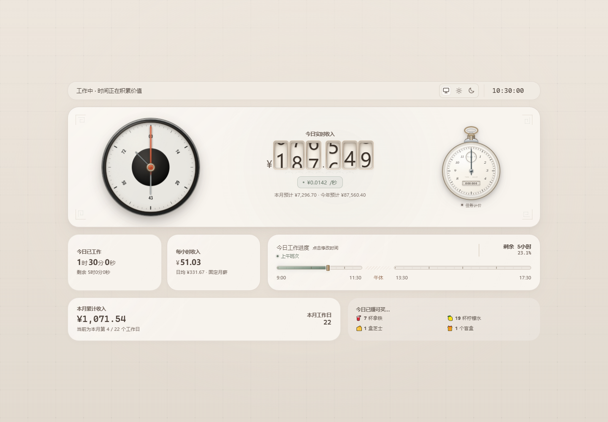
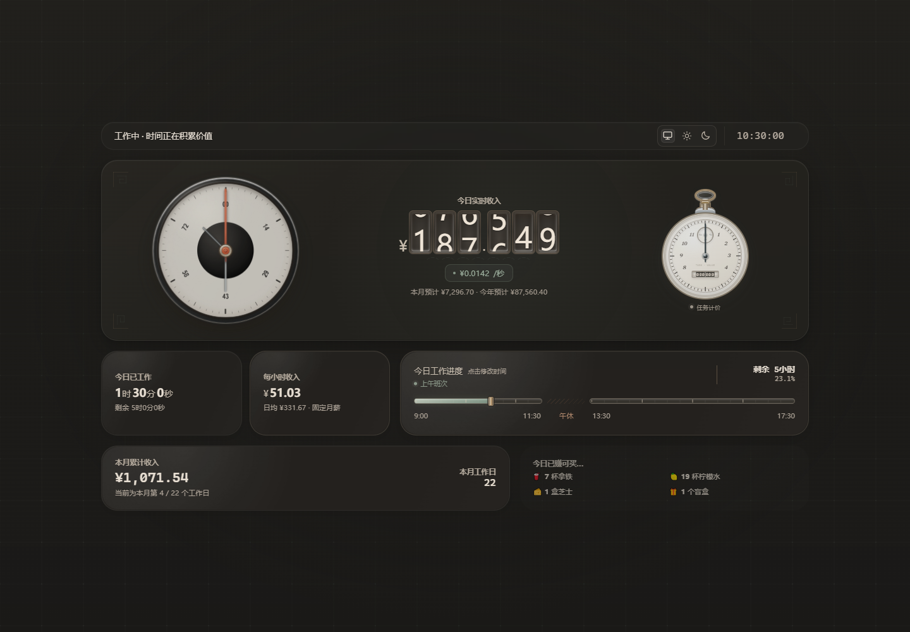

# Income-per-sed

## 产品介绍

可离线运行的收入仪表与任务计价工具，提供机械表盘、数字滚轮、工作进度、历史回溯、主题切换和 Scriptable 小组件。

[在线体验](https://zeuscupidcloris.github.io/Income-per-sed/) · [正式发布](https://github.com/ZeusCupidCloris/Income-per-sed/releases/latest)

深色与手机版预览

本仓库公开用于作品展示与版本存档，保留全部权利；公开不等于开源授权。使用范围见 [LICENSE](LICENSE)。

## 四文件入口

| 文件 | 用途 |
| --- | --- |
| [Income-per-sed-Push.html](Income-per-sed-Push.html) | 日常使用，可离线打开 |
| [Income-per-sed-Develop.html](Income-per-sed-Develop.html) | 开发维护与诊断，网页唯一修改源 |
| [IncomeWidget.js](IncomeWidget.js) | Scriptable iPhone、iPad 小组件 |
| [Income-per-sed 使用手册](docs/Income-per-sed（说明文档）.docx) | 使用、设置与故障排查 |

仓库候选文件与正式 Release 可能不是同一批，请勿混用。完整性可通过 [SHA256SUMS.txt](SHA256SUMS.txt) 核对。

## 快速使用

1. 下载并打开 Push 文件。
2. 点击“每小时收入”，设置收入方式和金额。
3. 点击“今日工作进度”，设置上午、午休和下午时间。
4. 使用顶部时间读数或快速回溯按钮回看；点击返回实时恢复当前时间。

小组件需安装 Scriptable，将 Widget 与 Push 文件放在 iCloud Drive 的 Scriptable 目录，按手册完成配置。页面设置保存在浏览器本地，清除站点数据会删除设置。年度日历每年手动替换。

## 当前版本

| 项目 | 标识 |
| --- | --- |
| 产品版本 | `2.5.4-rc.2`，候选版，并非新的正式 Release |
| 交付编号 | `20260930.1` |
| 小组件组件版本 | `2.5.3` |
| Push 浏览器标题 | `Income-per-sed` |
| Develop 浏览器标题 | `Income-per-sed · Develop` |
| 小组件设置菜单 | `Income-per-sed` |
| 手册封面 | `Income-per-sed 使用手册` |

版本对应关系以 [发布清单](release-manifest.json) 为准；发布是否完成以 GitHub 检查、合并与部署结果为准。旧图片与旧验收不自动代表本次通过。

本批文件从上方“四文件入口”获取，未创建 `2.5.4-rc.2` Release。普通更新只同步仓库和 Pages；经所有者确认的大版本才创建 Release，名称依次为 `V3`、`V4`、`V5`，产品版本仍使用 `3.0.0` 等格式。历史正式 Release 保留。

## 维护入口

按角色选择：[日常用户](docs/user/README.md) · [开发者](docs/developer/README.md) · [验收人员](docs/verification/README.md) · [项目维护者](docs/maintainer/README.md)。角色目录只提供导航，原文件位置与下载地址不变。

首页目录用途如下。日常打开网页只需要 Push，使用小组件再下载 Widget，其余主要供开发维护。

| 文件或目录 | 用途 | 阅读对象 |
| --- | --- | --- |
| `Income-per-sed-Push.html` | 日常使用的独立网页 | 用户 |
| `Income-per-sed-Develop.html` | 网页唯一修改源，包含诊断 | 开发者 |
| `IncomeWidget.js` | Scriptable 手机与平板小组件 | 用户 |
| `README.md` | 产品介绍、下载与快速使用 | 用户 |
| `docs/` | Word 手册、角色入口、维护与历史验收资料 | 用户与开发者 |
| `Attachment/` | 仓库地图、脚本用途和测试用途的集中索引 | 用户与开发者 |
| `CHANGELOG.md` | 版本与维护变更记录 | 用户与开发者 |
| `LICENSE` | 保留全部权利及使用范围 | 用户与开发者 |
| `release-manifest.json` | 产品、组件、交付版本及文件对应关系 | 开发者 |
| `SHA256SUMS.txt` | 文件完整性校验值 | 用户与开发者 |
| `.github/` | 自动检查、Pages、发布与安全配置 | 开发者 |
| `scripts/` | 构建、截图、校验及资源观察工具 | 开发者 |
| `tests/` | 业务、动效、恢复和视觉回归测试 | 开发者 |
| `config/` | 浏览器测试和截图配置 | 开发者 |
| `package.json` | 维护命令和工具依赖，不是网页运行依赖 | 开发者 |
| `package-lock.json` | 锁定维护工具的依赖版本 | 开发者 |
| `.editorconfig` | 编辑器缩进与格式约定 | 开发者 |
| `.gitattributes` | Git 换行和二进制文件规则 | 开发者 |
| `.gitignore` | 排除缓存、依赖和测试输出 | 开发者 |

- [仓库地图](Attachment/repository-map.md)：日常文件、维护工具与历史资料。
- [文档与验收索引](docs/README.md)：当前交付、待验收和历史记录。
- [脚本用途](Attachment/scripts-index.md) · [测试用途](Attachment/tests-index.md)。
- [维护与发布规则](docs/REPOSITORY_POLICY.md) · [更新记录](CHANGELOG.md)。
- [自动检查](https://github.com/ZeusCupidCloris/Income-per-sed/actions) · [安全报告](.github/SECURITY.md)。

维护时只修改 Develop，再生成 Push；不要分别编辑两个网页版本。日常下载路径与历史记录地址保持不变。
